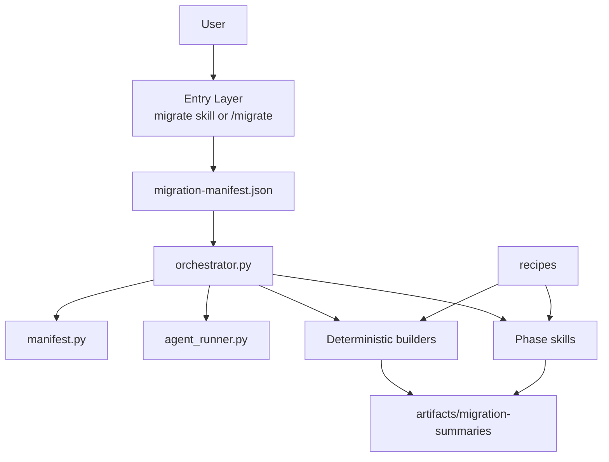
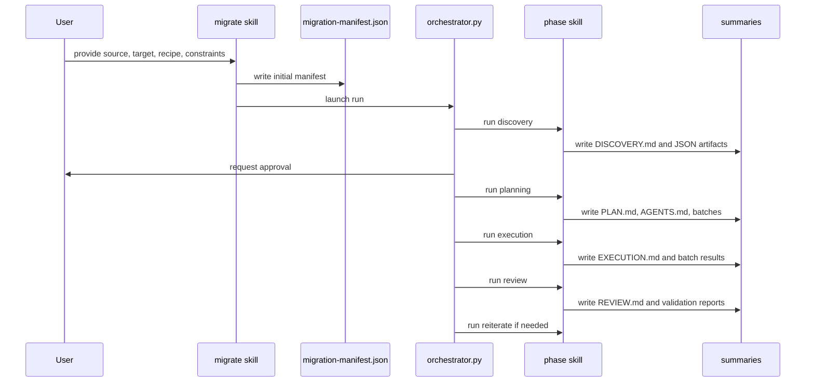
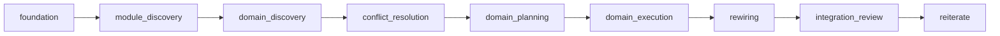

# Architecture

## Purpose

This project is an agentic migration framework. It separates deterministic control-plane work from LLM-driven reasoning so migrations stay resumable, reviewable, and auditable.

## Design Principles

- The manifest is the source of truth for state.
- Python scripts own orchestration, validation, and deterministic precomputation.
- Skills own phase behavior and artifact-writing instructions.
- Artifacts, not chat history, are the contract between phases.
- Human approval gates are built into the workflow.

## System Overview



## Main Layers

### 1. Entry Layer

Responsible for collecting migration intent and creating the manifest.

- `.codex/skills/migrate/SKILL.md`
- `.codex/commands/migrate.md`
- `.codex/README.md`

The `migrate` skill is the most reliable documented entry point because repo-local slash commands may not always be auto-registered.

### 2. Control Plane

Responsible for state transitions and phase sequencing.

- `.codex/scripts/orchestrator.py`
- `.codex/scripts/manifest.py`
- `.codex/scripts/agent_runner.py`

Responsibilities:

- load and update `migration-manifest.json`
- choose Tier 1 or Tier 2 phase sets
- launch the right phase skill
- wait for success markers such as `PLAN.md` or `REVIEW.md`
- stop for approvals
- resume from the manifest

### 3. Deterministic Builders

Responsible for machine-readable prep work before or around LLM phases.

- `discovery_builder.py`: file inventory, dependency graph, symbol index, risk signals
- `planning_builder.py`: dependency-safe planning inputs and risk policies
- `diff_scorer.py`: heuristic review scoring
- `recipe_verify_runner.py`: recipe verification hooks
- `validate_artifacts.py`: required artifact contract checks

Tier 2 adds:

- `tier2_foundation_builder.py`
- `tier2_module_discovery_builder.py`
- `tier2_domain_discovery_builder.py`
- `tier2_conflict_resolution_builder.py`
- `tier2_domain_planning_builder.py`
- `tier2_domain_execution_builder.py`
- `tier2_rewiring_builder.py`
- `tier2_integration_checker.py`

### 4. Phase Skills

Responsible for higher-level reasoning and approval-ready summaries.

- `discovery`
- `planning`
- `execution`
- `review`
- `reiterate`

Tier 2 extends this model with domain-focused phases.

### 5. Recipes

Responsible for migration-specific constraints and reusable patterns.

Example location:

- `.codex/recipes/example-generic/`

Recipes can define:

- recipe metadata
- domain list and ordering
- pattern files
- verification hooks
- optional Tier 2 templates

## Tier 1 Runtime



## Tier 2 Runtime



Tier 2 is used when the migration needs domain ownership, conflict handling, rewiring, and cross-domain review instead of one global execution pass.

## Core Data Contracts

### Manifest

`migration-manifest.json` stores:

- session metadata
- source and target paths
- recipe and optional reference path
- test, build, and lint commands
- phase statuses
- checkpoints

This is the only state file the orchestrator trusts for progress and resume.

### Artifacts

Each phase writes both machine-readable and human-readable outputs under:

```text
artifacts/migration-summaries/<phase>/
```

Examples:

- discovery: `dep-graph.json`, `file-manifest.json`, `DISCOVERY.md`
- planning: `AGENTS.md`, `migration-batches.json`, `PLAN.md`
- execution: `execution-summary.json`, `EXECUTION.md`
- review: `review-results.json`, `validation-report.json`, `REVIEW.md`
- reiterate: `reiterate-results.json`, `agents-md.patch.json`, `REITERATE.md`

The validator script enforces these contracts before the workflow moves ahead.

## Runtime Support Model

`agent_runner.py` supports:

- Codex CLI
- Claude Code
- Cursor CLI

The orchestrator prefers auto-detection but can also accept an explicit runtime override.

## Approval Model

Approvals are built into the state machine. The orchestrator marks phases as `awaiting_approval`, updates the manifest, and only continues after approval is recorded.

This keeps the workflow reviewable at the most important checkpoints.

## Extension Points

You can evolve the framework by:

1. adding a new recipe under `.codex/recipes/`
2. refining a skill contract under `.codex/skills/`
3. adding or strengthening deterministic builders under `.codex/scripts/`
4. expanding Tier 2 domain logic and templates

## Practical Reading Order

1. `README.md`
2. `.codex/README.md`
3. `.codex/skills/migrate/SKILL.md`
4. `.codex/commands/migrate.md`
5. `.codex/scripts/orchestrator.py`
6. `.codex/scripts/manifest.py`
7. `.codex/scripts/agent_runner.py`

## Summary

This repository is a migration control plane where deterministic Python scripts manage state and artifact contracts, while skill-driven agents perform the reasoning-heavy work inside a gated, resumable workflow.
