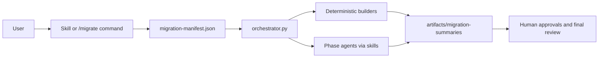

# Open-Ai- Migration Framework

This repository contains a deterministic, artifact-driven migration framework for agentic codebase migrations. It combines:

- Python control-plane scripts for orchestration, validation, and state management
- skill-driven LLM phases for discovery, planning, execution, review, and retries
- recipe-based migration rules for reusable patterns and verification

Most of the framework lives under `.codex/`.

## Steps To Use After Cloning

1. Clone the repository and move into it.

   ```bash
   git clone <your-repo-url>
   cd Open-Ai-
   ```

2. Make sure the required tools are available:
   - `python3`
   - one supported runtime: `codex`, `claude`, or `cursor-agent`

3. Open Codex in this repository.

4. Discover available commands and skills:

   ```text
   /skills
   /list-skills
   ```

5. Start the migration flow:

   ```text
   /migrate
   ```

6. If `/migrate` is not available in your Codex runtime, use the fallback prompt:

   ```text
   Use the migrate skill to start a migration
   ```

7. Provide the migration inputs when prompted:
   - source description
   - target description
   - source path
   - target path
   - recipe id or recipe path
   - optional reference path
   - optional test, build, and lint commands
   - non-negotiables

8. Review the generated summary, confirm launch, and approve gated phases as the workflow progresses.

9. Inspect outputs in:

   ```text
   artifacts/migration-summaries/
   ```

## What The Project Does

Given a source codebase, a target location, and a recipe, the framework:

1. collects migration intent
2. writes a `migration-manifest.json`
3. runs a phase-based orchestrator
4. stores machine-readable and human-readable artifacts
5. pauses for approvals at key checkpoints

## End-to-End Flow



## Human-Friendly Workflow

If you are using a Codex surface that supports slash commands, the expected flow is:

1. Run `/skills`
2. Run `/list-skills`
3. Run `/migrate`
4. Answer the prompts for source path, target path, recipe, and constraints
5. Review the summary and confirm launch
6. Approve gated phases when Codex asks

If `/migrate` is not exposed in your local runtime, the documented fallback is the `migrate` skill prompt:

```text
Use the migrate skill to start a migration
```

## Phase Model

### Tier 1

Used for simpler migrations where one rulebook can drive most files.

```text
discovery -> planning -> execution -> review -> reiterate
```

### Tier 2

Used for larger or cross-paradigm migrations that need domain decomposition.

```text
foundation -> module_discovery -> domain_discovery -> conflict_resolution
-> domain_planning -> domain_execution -> rewiring -> integration_review
-> reiterate
```

## Key Files

- `.codex/skills/migrate/SKILL.md`: primary migration entry point
- `.codex/commands/migrate.md`: slash-command workflow contract
- `.codex/scripts/orchestrator.py`: deterministic control plane
- `.codex/scripts/manifest.py`: manifest state updates
- `.codex/scripts/agent_runner.py`: runtime adapter for Codex, Claude Code, and Cursor
- `.codex/recipes/example-generic/`: sample recipe, patterns, verification hooks, and sample source

## Repository Layout

```text
.
├── ARCHITECTURE.md
├── README.md
└── .codex
    ├── README.md
    ├── commands/
    ├── recipes/
    ├── scripts/
    └── skills/
```

## Requirements

- `python3`
- one supported runtime:
  - `codex`
  - `claude`
  - `cursor-agent`
- a source directory to migrate
- a target directory to write into
- a recipe id or explicit recipe path

The framework itself uses Python stdlib only, so you do not need a virtual environment just to run the orchestrator.

## Outputs You Should Expect

- `migration-manifest.json`: source of truth for run state
- `artifacts/migration-summaries/<phase>/`: per-phase summaries and machine artifacts
- phase docs such as:
  - `DISCOVERY.md`
  - `PLAN.md`
  - `EXECUTION.md`
  - `REVIEW.md`
  - `REITERATE.md`

## Example Recipe

The sample recipe in `.codex/recipes/example-generic/` shows how to define:

- recipe metadata in `recipe.json`
- domain ordering
- per-domain pattern files
- optional verification hooks under `verify/`

## More Detail

For the system design, phase ownership, and artifact contracts, see [ARCHITECTURE.md](/Users/harshit/Desktop/Hackathin/Open-Ai-/ARCHITECTURE.md).
